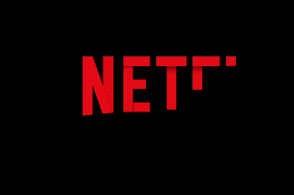

 

# 🎬 Netflix Data Analysis with PostgreSQL

## 📌 Project Overview
This project explores Netflix's movie and TV show catalog using PostgreSQL to answer business-focused questions through SQL analysis. The objective is to demonstrate practical data analysis skills by transforming raw data into actionable insights using SQL queries, aggregation, window functions, and data manipulation techniques.

The project covers data exploration, business problem solving, and insight generation that can support content strategy and decision-making.

## 🛠️ Skills Demonstrated
* SQL (PostgreSQL)
* Data Cleaning & Exploration
* Data Analysis
* Window Functions
* Aggregate Functions
* String Manipulation
* Date Functions
* Common Table Expressions (CTEs)
* Business Insight Generation
## 📂 Dataset
* Source: Netflix Movies & TV Shows Dataset (Kaggle)
* Database: PostgreSQL
* Table: [Dataset](https://www.kaggle.com/datasets/shivamb/netflix-shows)
* Dataset contains information including:
     * Title
     * Content Type
     * Director
     * Cast
     * Country
     * Release Year
     * Date Added
     * Rating
     * Duration
     * Genre
     * Description

## 📊 Business Questions Solved

This project answers 15 real-world business questions:

1.	Compare the distribution of Movies vs TV Shows.
2.	Identify the most common rating for each content type.
3.	Retrieve all movies released in 2021.
4.	Find the top 5 countries producing the most Netflix content.
5.	Identify the longest movie available.
6.	Find content added to Netflix within the last five years.
7.	List all titles directed by Rajiv Chilaka.
8.	Find TV Shows with more than three seasons.
9.	Analyze content distribution across genres.
10.	Calculate yearly content contribution from India.
11.	Retrieve all Documentary movies.
12.	Identify titles without a listed director.
13.	Find Salman Khan movies released within the last 10 years.
14.	Identify the top 10 actors appearing in Indian-produced movies.
15.	Classify content as Adult or Non-Adult using keyword analysis.

## 🗄️ Database Setup
* Create Database
      CREATE DATABASE Netflix_DB;

* Created the table 'netflix' with the schema.

            Create table netflix
              (
              	show_id varchar(7),
              	type varchar(20),
              	title varchar(120),
              	director varchar(250),
              	casts varchar(1000),
              	country varchar(150),
              	date_added varchar(50),
              	release_year int,
              	rating varchar(20),
              	duration varchar(20),
              	listed_in varchar(100),
              	description varchar(250)
              );
* Import the Kaggle dataset into PostgreSQL after creating the table.

## 🔍 Data Exploration
* Before analysis, exploratory SQL queries were used to understand the dataset.

Examples include:

   * Total number of records
   * Unique content types
   *	Missing values
   *	Genre distribution
   *	Country distribution
   *	Release year trends

Example:
* To find the number of records in the 'netflix' dataset using the following query:

        select count(*) from netflix;
    
* To find the number of categorise in each type using distinct keyword as follows:

        select distinct(type) from netflix;

## 📈 SQL Techniques Used
Throughout the project, the following SQL concepts were applied:
*	GROUP BY 
*	ORDER BY 
*	CASE Statements 
*	Window Functions (RANK()) 
*	String Functions : STRING_TO_ARRAY(), UNNEST(), SPLIT_PART() 
*	Date Functions : TO_DATE(), EXTRACT() 
*	Pattern Matching : LIKE, ILIKE 
*	Aggregate Functions: COUNT(), MAX(), ROUND()

## 💡 Key Insights
### 🎥 Content Distribution

Netflix's catalog contains a significantly larger number of movies than TV shows, indicating a stronger investment in film content.

### 🌍 Regional Content

Countries such as the United States and India contribute a substantial share of Netflix's library, highlighting regional production priorities.

### 📅 Content Growth

The platform has expanded rapidly in recent years, with a large volume of titles added during the last five years.

### 🎭 Genre Analysis

Drama, International Movies, and Documentaries are among the most represented genres within the catalog.

### 👨‍👩‍👧 Audience Segmentation

Content ratings indicate that Netflix primarily targets mature audiences while maintaining a considerable library for family and children's entertainment.

### 🎬 Cast & Director Analysis

The project identifies prolific directors and actors, providing insights into recurring industry collaborations.

## 📈 Business Value

This analysis demonstrates how SQL can be used to answer business questions such as:

Which regions should Netflix prioritize for future investments?
What genres dominate the platform?
How has Netflix's content strategy evolved over time?
Which audience segments receive the most content?
Which actors and directors contribute most frequently to regional productions?

## 🚀 Project Outcome

This project showcases practical SQL skills required in a Data Analyst role by:

* Cleaning and exploring real-world datasets
* Writing optimized SQL queries
* Solving business-driven analytical problems
* Extracting actionable insights from structured data
* Presenting findings in a clear, business-oriented format

## 🛠️ Technologies Used
*	PostgreSQL
* SQL
*	Kaggle Dataset
*	Git
*	GitHub
              
## 📚 Repository Structure
📁 Netflix-SQL-Analysis
>
> dataset/
>> netflix_titles.csv
>>
>sql/
>> data_exploration.sql
>> 
>> business_queries.sql
>>
> README.md

### Contact:
For any queries or inquiries, please contact [revathigangadaran@gmail.com].
